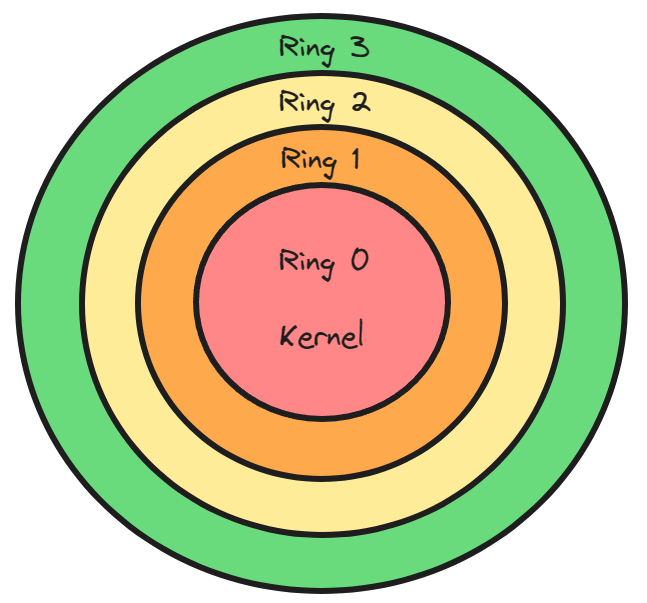
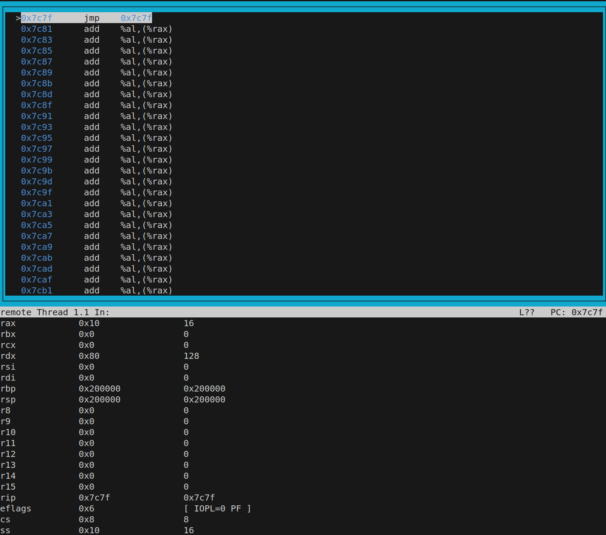
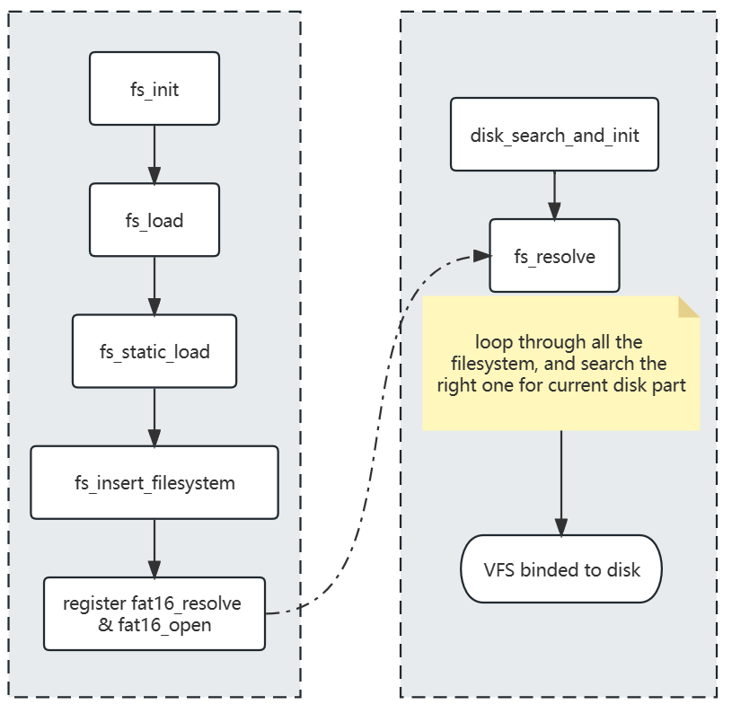

---

## Bootloader

A generally small program responsible for loading the kernel of an operating system.

The response is to put us into protected mode, which will give us four gigabytes of address space.


- The BIOS is executed directly from ROM. 
- The BIOS generally loads itself into RAM then continues execution from RAM.
- The BIOS will initialize essential hardware.
- The BIOS looks for a bootloader to boot by searching all storage mediums for the boot signature "0x55AA".
- The BIOS loads the bootloader into RAM at absolute address Ox7c00.
- The BIOS instructs the process to perform a jump to absolute address Ox7c00 and begin executing the operating systems bootloader.


The BIOS is a kernel in its self.

> The BIOS contains routines to assist our bootloader in booting our kernel.
> The BIOS is 16 bit code which means only 16 bit code can execute it properly.
> The BIOS routines are generic and a standard (More on that later).


### The first step of bootloader

```assembly
; address to load this program, boot sector
ORG 0x7c00
; instruction set
BITS 16

start:
    mov si, message
    call print
    jmp $

print:
    mov bx, 0
    ; if al not equal to 0, this will loop and traverse message chars.
.loop:
    ; load register si into register al, then increment si.
    lodsb
    cmp al, 0
    je .done
    call print_char
    jmp .loop

.done:
    ret

print_char:
    ; interupt to ouptut chars to screen. http://www.ctyme.com/intr/int-10.htm
    mov ah, 0eh
    ; invoke BIOS, output char in register al.
    int 0x10
    ret


message: db 'Hello World!', 0

; 512bytes, the 511 and 512 byte must be boot signiture.
times 510-($ - $$) db 0
dw 0xAA55
```

```sh
nasm -f bin ./boot.asm -o ./boot.bin

# check bin
ndisasm ./boot.bin

# run in qemu
qemu-system-x86_64 -hda ./boot.bin
```

> You can boot it from a USB stick
>
> ```sh
> sudo dd if=./boot.bin of=/dev/sdb
> ```

## Real Mode

- Only 1M RAM access. Memory access is done through the segmentation memory model.
- Based on the original x86 design. It acts like the 8086 processor from the 1970s.
- No security for memory and hardware.
- 16 bit`s accessible at one time. Only 8bits and 16bits registers can be accessed. The offset of our memory address is up to 65535.


### Segmentation memory model

- Memory is accessed by a segment and an offset.
- Programs can be loaded in different areas of memory without problems.
- Multiple segments are available through the use of segment registers.

#### 8086 segment registers

- CS -- Code Segment
- SS -- Stack Segment
- DS -- Data Segment
- ES -- Extra Segment

#### Absolute Offset

Take the segment register multiply it by 16 and add the offset.

```
ORG 0x7c00
```

(0x7c0 * 16)  + 0 = 0x7c00.

> e.g. 0x7cff
>
> 1. Segment Way 1： 0 offset 0x7cff
> 2. Segment Way 2： 0x7c0 offset 0xFF
> 3. Segment Way 3： 0x7cf offset 0x0F
>
> Calculation
> 	0x7cf * 16 = 0x7cf0
> 	0x7cf0 + 0x0f = 0x7cff


"lodsb" uses the DS:SI register combination to get absolute address.

> e.g.
>
> ```assembly
> org 0
> mov ax, 0x7c0
> mov ds, ax
> mov si, 0x1f
> lodsb
> ```
>
> address is: 0x7c0 * 16 + 0x1f = 0x7c1f

#### Programs can be loaded in different areas of memory without problems

Imagine we have two programs loaded into memory, both were assembled with the origin being zero.

- Program 1 uses segment 0x7c0 for all its segment registers. Program 1 is loaded at address 0x7C00.
- Program 2 uses segment 0x7D0 for all its segment registers. Program 2 is located at address 0x7D00.

We swap our segment registers when switching to the other process. And we restore all the registers of the process we are switching too.


#### Multiple segments are available through the use of segment registers

```assembly
mov byte al, [es:32]
;  es * 16 + 32
```

> e.g.
>
> SS = 0x00
>
> SP(stack pointer) = 0x7c00
>
> Push 0xffff, then SP will decrement by 2 to 0x7bfe.
>
> Then set 0x7bfe and 0x7bff to value 0xffff.


## Interrputs

lnterrupts are like subroutines, but you don't need to know the memory address to invoke them. lnterrupts are called through the use of interrupt numbers rather than memory addresses. 

lnterrupts can be setup by the programmer. For example you could set up interrupt “0x32” and let it point to your code.

### Interrputs Table

The table has 256 interrupt handlers. Every entry contains 4 bytes (OFFSET:SEGMENT,  2 bytes: 2bytes).

`SEGMENT * 16 + OFFSET` is the handler`s address. 

The 0x13 interrupt will go to offset (0x13 * 4 = 0x46) from the beginning of Interrupt Vector Table.

  

---

## Disk

The disk itself has no concept of files. The disk itself just holds loads of data blocks called sectors. 

Filesystems are kernel implemented they are not the responsibility of the hard disk. Implementing a filesystem requires the kernel programmer to create a filesystem driver for the target file system.

Data is read and written in sectors typically 512 byte blocks for example. Reading the sector of a disk will return 512 bytes of data for the chosen sector.

> CHS(CYLINDER HEAD SECTOR)
>
> > Sectors are read and written by specifying "head" "track"and "sector".
> >
> > This is old fashioned and not the modern way of reading from a disk drive.

> LBA(LOGICAL BLOCK ADDRESS)
>
> > This is the modern way of reading from a hard disk, rather than specify "head" "track" and "sector" we just specify a number that starts from zero.
> >
> > LBA allows us to read from the disk as if we are reading blocks from a very large file.
> >
> > LBA 0 = first sector on the disk;  LBA 1 = second sector on the disk.

Let`s say we want to read the byte at position 58376 on the disk how do we do it?

LBA = 58376 / 512 = 114. Now if we read that LBA we can load 512 bytes into memory. Next we need to know our offset that our byte is in our buffer.

Offset = 58376 ％ 512 = 8. 

Then 114 * 512 = 58368 ;   58368 + 8 = 58376.

ln 16 bit real mode the BIOS provides interrupt `13h` for disk operations.

ln 32 bit mode you have to create your own disk driver which is a little more complicated.


[READ SECTOR(S) INTO MEMORY](http://www.ctyme.com/intr/rb-0607.htm):  this shows how to use `interrput 13` to read data sectors into memory.


---


## Protected Mode

Protected mode is a processor state in x86 architectures which gives access to memory protection, more than 4GB address space.

Protected mode allows you to protect memory from being accessed. It prevents user program talking with hardware.



Ring 1 and Ring 2 usually are at device driver privilege level. Ring 3 is at user application level.

### Memory schemes

#### Selectors

Use segmentation registers as selector registers that point to data structures that describe `memory ranges` and `the premissions(ring level)`. 

#### Paging

Memory is virtual and what you address can point to somewhere entirely different in memory. It makes memory control easier to control.

Paging is the most popular choice for memory schemes with kernel or operating system.

Now we can address up to `4GB` of memory with 32-bit registers.  We are no longer limited to the `1MB` of memory provided by `real mode`.


### Entering Protected Mode

Before switching to protected mode, you must:

- Disable interrupts, including [NMI](https://wiki.osdev.org/Non_Maskable_Interrupt) (as suggested by Intel Developers Manual).
- Enable the [A20 Line](https://wiki.osdev.org/A20_Line).
- Load the [Global Descriptor Table](https://wiki.osdev.org/Global_Descriptor_Table) with segment descriptors suitable for code, data, and stack.

The Global Descriptor Table (GDT) is a binary data structure specific to the [IA-32](https://wiki.osdev.org/IA32_Architecture_Family) and [x86-64](https://wiki.osdev.org/X86-64) architectures. It contains entries telling the CPU about memory [segments](https://wiki.osdev.org/Segmentation). A similar [Interrupt Descriptor Table](https://wiki.osdev.org/Interrupt_Descriptor_Table) exists containing [task](https://wiki.osdev.org/Task) and [interrupt](https://wiki.osdev.org/Interrupts) descriptors.


GDB test:

```sh
target remote | qemu-system-x86_64 -hda ./boot.bin -S -gdb stdio
```




### A20 Line

The A20 Address Line is the physical representation of the 21st bit (number 20, counting from 0) of any memory access.

> On most newer computers starting with the IBM PS/2, the chipset has a FAST A20 option that can quickly enable the A20 line. 

```assembly
in al, 0x92   ; read from port 0x92 by processor bus
or al, 2      ; change 1 bit
out 0x92, al  ; write back by processor bus
```

> ```bash
> sudo apt install build-essential libgmp3-dev bison libmpfr-dev texinfo  libisl-dev
> ```
>
> libcloog-isl-dev can`t find in package sourcess.


---


## Cross Compiler Install

Follow tutorial [GCC Cross-Compiler - OSDev Wiki](https://wiki.osdev.org/GCC_Cross-Compiler) install  [Binutils](https://gnu.org/software/binutils/) and  [GCC](https://gnu.org/software/gcc/)( [note](https://stackoverflow.com/questions/9253695/building-gcc-requires-gmp-4-2-mpfr-2-3-1-and-mpc-0-8-0): run ./contrib/download_prerequisites before you run gcc-x.y.z/configure ).

 We will no longer have the standard library and the system standard library. You have to write them yourself.

We can use the new compiler like this:

```sh
$HOME/opt/cross/bin/$TARGET-gcc --version
```

To use your new compiler simply by invoking `$TARGET-gcc`, add `$HOME/opt/cross/bin` to your `$PATH` by typing:

```sh
export PATH="$HOME/opt/cross/bin:$PATH"
```

> Some test command:
>
> ```sh
> # in gdb  0x100000 the code segment start.
> add-symbol-file ./build/kernelfull.o 0x100000
> 
> break _start
> 
> target remote | qemu-system-x86_64 -S -gdb stdio -hda ./bin/os.bin
> ```


---

## Text Mode

Text mode allows you to write ASCII to video memory. And it support 16 unique colors. By using text mode, there is no need to set individual screen pixels for printing characters.

You write ASCII characters into memory starting at address 0xB8000 for colored displays, or for monochrome displays address 0xB0000. Each ASCII character written to this memory has its pixel equivalent outputted to the monitor.

[Default EGA 16-color palette](https://en.wikipedia.org/wiki/Enhanced_Graphics_Adapter): 

| Index | Default palette number |  Default palette color   | rgbRGB | Hexadecimal |
| :---: | :--------------------: | :----------------------: | :----: | :---------: |
|   0   |           0            |          Black           | 000000 |   #000000   |
|   1   |           1            |           Blue           | 000001 |   #0000AA   |
|   2   |           2            |          Green           | 000010 |   #00AA00   |
|   3   |           3            |           Cyan           | 000011 |   #00AAAA   |
|   4   |           4            |           Red            | 000100 |   #AA0000   |
|   5   |           5            |         Magenta          | 000101 |   #AA00AA   |
|  20   |           6            |          Brown           | 010100 |   #AA5500   |
|   7   |           7            |    White / light gray    | 000111 |   #AAAAAA   |
|  56   |           8            | Dark gray / bright black | 111000 |   #555555   |
|  57   |           9            |       Bright Blue        | 111001 |   #5555FF   |
|  58   |           10           |       Bright green       | 111010 |   #55FF55   |
|  59   |           11           |       Bright cyan        | 111011 |   #55FFFF   |
|  60   |           12           |        Bright red        | 111100 |   #FF5555   |
|  61   |           13           |      Bright magenta      | 111101 |   #FF55FF   |
|  62   |           14           |      Bright yellow       | 111110 |   #FFFF55   |
|  63   |           15           |       Bright white       | 111111 |   #FFFFFF   |

We can use byte 0 to set ASCII character, and byte 1 to set color. E.g. `0xB8000 = 'A' 0xB8001 = 0x00` will set row 0 column 0 to `black 'A'`. `0xB8002 = 'B' 0xB8003 = 0x00` will set row 0 column 1 to `black 'B'`.


---

##  Interrupt Descriptor Table

> [Reference](https://wiki.osdev.org/Interrupt_Descriptor_Table)

Interrupt descriptor table describes how interrupts are invoked in protected mode.  Similarly to the interrupt vector table, the interrupt descriptor table describes how interrupts are setup in the CPU so that if someone causes an "int 5", it will invoke the code for interrupt 5 as described by the interrupt descriptor table.

> Interrupt descriptor table can be mapped anywhere in memory. 
>
> It is different from the `interrupt vector table`.

```c
struct idt_desc {
   uint16_t offset_1;        // offset bits 0..15
   uint16_t selector;        // a code segment selector in GDT or LDT
   uint8_t  zero;            // unused, set to 0
   uint8_t  type_attributes; // gate type, dpl, and p fields
   uint16_t offset_2;        // offset bits 16..31
} __attribute__((packed));   // keep it as it is, no alignment
```

How a certain interrupt is served depends on which kind of gate you put in the IDT entry. 

- An **Interrupt Gate** is used to specify an **[Interrupt Service Routine](https://wiki.osdev.org/Interrupt_Service_Routines)**. Interrupts gates are to be used for interrupts that we want to invoke our code. The value is (0x05 / 0b0101) in 32-bit mode.
- A **Trap Gate** should be used to handle **[Exceptions](https://wiki.osdev.org/Exceptions)**.  Trap gates are like interrupt gates, however they are used for exceptions. They also disable interrupts on entry and re-enable them on an "iret" instruction. The value is (0x06 / 0b0110) in 16-bit mode and (0x0F / 0xb1111) in 32-bit mode.
- A **Task Gate** is a gate type specific to IA-32 that is used for hardware task switching. Tasks gates reference TSS descriptors and can assist in multi-tasking when exceptions occur. The value is (0x07 / 0b0111) in 16-bit and (0x0E / 0b1110) in 32-bit mode.

Interrupt descriptors are stored in an array with index 0 defining interrupt zero "int 0". Index 1 defining interrupt one "int 1" and so on. It just like array structure.

The IDTR(Interrupt Descriptor Table Register) structure, saves the IDT base address and the length of IDT: 

```c
struct idtr_desc {
    uint16_t limit;  // the length of the IDT minus one
    uint32_t base;   // the address of IDT
} __attribute__((packed));
```


***


## Programmable Interrupt Controller

Programmable interrupt controller allows hardware to interrupt the processor state. The programmable interrupt controller allows different types of hardware to interrupt the processor such as the hard disk, keyboard and more.

[Standard ISA(Industry Standard Architecture) IRQ(Interrupt Request)s](https://wiki.osdev.org/Interrupts):

| IRQ  | Description                                                  |
| ---- | ------------------------------------------------------------ |
| 0    | Programmable Interrupt Timer Interrupt                       |
| 1    | Keyboard Interrupt                                           |
| 2    | Cascade (used internally by the two PICs. never raised)      |
| 3    | COM2 (if enabled)                                            |
| 4    | COM1 (if enabled)                                            |
| 5    | LPT2 (if enabled)                                            |
| 6    | Floppy Disk                                                  |
| 7    | LPT1 / Unreliable ["spurious" interrupt](https://wiki.osdev.org/8259_PIC#Spurious_IRQs) (usually) |
| 8    | CMOS real-time clock (if enabled)                            |
| 9    | Free for peripherals / legacy SCSI / NIC                     |
| 10   | Free for peripherals / SCSI / NIC                            |
| 11   | Free for peripherals / SCSI / NIC                            |
| 12   | PS2 Mouse                                                    |
| 13   | FPU / Coprocessor / Inter-processor                          |
| 14   | Primary ATA Hard Disk                                        |
| 15   | Secondary ATA Hard Disk                                      |

IRQ`s are mapped to a starting interrupt, for example 0x20: 

- IRQ 0 would then be interrupt 0x20.
- IRQ 1 would then be interrupt 0x21.
- IRQ 2 would then be interrupt 0x22.

By default some of the IRQ`s are mapped to interrupts 8-15. This is a problem as these interrupts are reserved in protected mode for exceptions. So we are required to **remap the PIC** (Programmable Interrupt Controller).

The system has two PIC (Programmable Interrupt Controller), one for master ports(0x20 and 0x21) and the other for slave ports(0xA0 and 0xA1). The master handles IRQ 0-7, and the slave handles IRQ 8-15.

And you must let the PIC controller know when you have handled the interrupt, which can be done by `outb` function. If you don`t acknowledge it, the PIC will no longer interrupt for that request.


***


## Heap

In the C programming language you can point to any memory address in RAM regardless if you can access it or not.

In protected mode we have certain restrictions, the processor is in a 32bit state. As we are running in a 32 bit mode we have access on to 32 bit memory addresses allowing us to address to a maximum of 4.29GB or 4294967296 bytes of ram regardless of how much system RAM is installed.

When you boot up your system, the memory is in an initialized state, your BIOS will start initializing certain pieces of memory and so on. Video memory takes up portions of RAM. Hardware memory takes IJP portions of RAM. Unused parts of RAM are available for use.

An array of uninitialized memory is available to us from address “ 0x01000000 ” (depending on the installed memory). And address: `0xC0000000` is reserved, this means the memory array we have at address 0x01000000 can give us a maximum of 3.22GB for a machine with 4GB physical memory or higher installed.

The heap will be responsible for storing information in our kernel.

### Implementation

The simple implementation in this project consists of a giant table which describes  the pieces of free memories in the system. This table will describe which memory is taken, which memory is free and so on. We will call this the `entry table`.

Using another pointer to a giant piece of free memory, this will be the actual heap data its self that `malloc` can use. We will call this the `data pool`. If our heap can allocate 100 MB of ram then the heap data pool will be 1 00MB in size.

The heap implementation is block based, each address returned from "malloc" will be aligned to 4096 and will at least be 4096 in size. This may cause memory fragmentation problem.

The item of the entry table is constructed in the following way:

|   bit   |   7   |    6     |  5   |  4   |  3   |  2   |  1   | 0    |
| :-----: | :---: | :------: | :--: | :--: | :--: | :--: | :--: | ---- |
| meaning | HAS_N | IS_FIRST |  0   |  0   | ET_3 | ET_2 | ET_1 | ET_1 |

HAS_N = Set if the entry to the right of current block is part of our allocation.

IS_FIRST = Set if this is the first entry of our allocation.

ET_3 to ET_0 = Set the type of the corresponding memory block in data pool, that is `block taken` or `block free`.

Each entry byte describes 4096 bytes of data in the heap data pool.

For example, "0xC1 0x81 0x81 0x01"，means the adjacent four blocks of memory in data pool is malloced to user.

We allocate in memory blocks meaning misaligned sizes requested from our heap will result in wasted lost bytes. And there may be some small blocks of memory fragmentation, which can be solved by `paging` techniques.

[More info](https://wiki.osdev.org/Memory_Map_(x86))


> GDB test commands:
>
> ```sh
> # in gdb  0x100000 the code segment start.
> add-symbol-file ./build/kernelfull.o 0x100000
> 
> # qemu-system-i386 for 32-bit system test
> # Use 32-bit system to avoid address mismatching potential problem.
> target remote | qemu-system-i386 -S -gdb stdio -hda ./bin/os.bin
> ```


***


## Paging

Paging allows us to remap one memory address to another, so 0x100000 could point to 0x200000. Paging works in 4096 byte block sizes by default. The blocks are called pages. When paging is enabled the MMU (Memory Management Unit) will look at your allocated page tables to resolve virtual addresses into physical addresses. 

> Essentially virtual address and physical address are just terms we used to explain how a piece of memory is being accessed.

Physical addresses are absolute addresses in memory whose value points to the same address in memory. For example physical address 0x100000 points to address 0x100000.

The structure of paging is like this:

- 1024 page directories that point to 1024 page tables;
- 1024 page table entries per page table;
- Each page table entry covers 4096 bytes of memory.
- Each “ 4096 ” byte block of memory is called a page.
- 1024 * 1024 * 4096 = 4,294,967,296 Bytes / 4GB of addressable memory.


Paging hides physical memory from processes. If we give each process its own page directory table then we can map the memory for the process.

Hiding memory can be achieved by switching the page directories when moving between processes. All processes can access the same virtual memory addresses but they will point to different physical addresses.

We can pretend we have the maximum amount of memory even if we do not. This is achieved by creating page tables that are not present. Once a process accesses this non-present address a page fault will occur. We can then load the page back into memory and the process had no idea.


### Page Table Entry Structure

| 31                            | 11     | 9    |      |      |      |      |      |      |      |    0 |
| ----------------------------- | ------ | ---- | ---- | ---- | ---- | ---- | ---- | ---- | ---- | ---: |
| Physical 4-KB Aligned Address | Avail. | G    | 0    | D    | A    | C    | W    | U    | R    |    P |

- Page table 4-KB Aligned Address: The physical 4096 byte aligned address to the start of a page table.
- G: Set to prevent TLB from updating the address in its cache if the CR3 register is reset.
- D: If set this indicates the page has been written to.
- A: Set to 1 by the CPU if this page is accessed.
- C: Cache Disable Bit. Set to 1 to disable page caching.
- W: If this bit is set then `write through caching` enabled if not then `write back` is enabled instead.
- U: If this set then this page can be accessed by all privilege ring levels. If it is not set then only supervisor ring levels can access this page.
- R: If this bit is set, the page is readable and writable, if its not set then this page is only readable. Note the WP bit in the CR0 register can allow writing in all cases for supervisor.
- P: This bit is set if the page exists in real memory, if this page is not actually available then we the kernel developer should set this bit to zero. If someone accesses this memory, a "Page fault" will occur and we are expected to resolve it by loading the pages from disk storage.


### Page Fault Exception

The CPU will call the page fault interrupt 0x14 when their was a problem with paging. The exception is invoked:

1. if you access a page in memory that does not have its "P (Present)" bit set.
2. invoked if you access a page that is for supervisor but you are not supervisor.
3. invoked if you write to a page that is read only and you are not supervisor.


[More about paging](https://wiki.osdev.org/Paging)


***

## Read From Hard Disk

### PCI IDE controller

[IDE](https://wiki.osdev.org/PCI_IDE_Controller) is a keyword which refers to the electrical specification of the cables which connect ATA drives (like hard drives) to another device.  The drives use the ATA (Advanced Technology Attachment) interface. 

IDE allows up to 4 drives to be connected.

- ATA (Serial) (SATA): Used for modern hard drives.

- ATA (Parallel): Used for hard drives.
- ATAPI (Serial) (PATA): Used for modern optical drives.
- ATAPI (Parallel): Commonly used for optical drives.

When using SATA, data is transmitted bit by bit along a single wire. SATA interfaces generally offer higher transfer rates. For example, SATA III (SATA 3.0) can achieve speeds up to 6 Gbps (6 billion bits per second).

When using PATA, data is transmitted simultaneously across multiple wires. Common versions include ATA-33, ATA-66, ATA-100, and ATA-133, with respective transfer rates of 33 MB/s, 66 MB/s, 100 MB/s, and 133 MB/s.

Kernel programmers do not have to care if the drive is serial or parallel. Possible driver types:

- primary master drive
- primary slave drive
- secondary master drive
- secondary slave drive

> Since interrupts (like INT 13h) can't be called easily in protected mode or long mode, direct disk access through ports might be the only solution


[More about write sectors](https://wiki.osdev.org/ATA_read/write_sectors)


***


## File System

A file system is a structure that describes how information is laid on a disk. Disks are not aware of files. The operating system knows the filesystem structure, so the system knows how to read files from disk. `Files` do not exist on the disk, but the `data` does.

###   File System Structure

File system contains raw data for files. And it contains the filesystem structure header which explains things such as how many files are on the disk, where the root directory is located and so on.

Without filesystems we would be forced to read and write data through the use of sector numbers, structure would not exist and corruption would be likely.

Common file systems include, FAT16, FAT32, NTFS and more.

### FAT16(File Allocation Table 16 bits per FAT entry)

The first sector in this filesystem format is the boot sector on a disk. Fields also exist in this first sector that describe the filesystem such as how many reserved sectors follow this sector.

Then follows the reserved sectors these are sectors ignored by the filesystem.

Then follows the first file allocation table contains values that represent which clusters on the disk are taken and which are free.(A cluster is just a certain number of sectors joined together to represent one cluster)

Next comes our second file allocation table, it`s optional though. And it depends on the FAT16 header in the boot sector.

Now comes our root directory this explains what files/directories are in the root directory of the filesystem. Each entry has a relative name. One entry represents the file or directory name. One entry represents attributes such as read only. One entry represents the address of the first cluster representing the data on the disk. And more.

Finally we have our data region, all the data is here.


FAT16 uses clusters to represent data and subdirectories. Each cluster uses a fixed amount of sectors which is specified in the boot sector. 

Every file in FAT16 needs to use at least one cluster for its data. This means a lot of storage is wasted for small files. It`s not the most efficient filesystem.

FAT16 cannot store files larger than 2GB without large file support. With large file support 4GB is the maximum.


FAT16 disk layout is like:

| Name             | Size                                                         |
| ---------------- | ------------------------------------------------------------ |
| Boot sector      | 512 bytes (assume sector size is 512 bytes)                  |
| Reserved Sectors | Fat_header.reserved_sectors * 512                            |
| FAT 1            | Fat_headers.sectors_per_fat * 512                            |
| FAT2 (Optional)  | Fat_headers.sectors_per_fat * 512                            |
| Root Directory   | Fat_header.root_dir_entries * sizeof(struct fat_directory_item). <br />rounded to next sector if needed |
| Data Clusters    | --                                                           |


Each entry in the table is 2 bytes long and represents a cluster in the data clusters region that is available or taken. 

Clusters can chain together, for example a file larger than one cluster will use two clusters. The value that represents the first cluster in the file allocation table will contain the value of the next cluster. The final cluster will contain a value of 0xffff signifying that there are no more clusters. The size of a cluster is represented in the boot sector. 


In the boot sector contains the maximum number of root directory entries we should not exceed this value when iterating through the root directory. When we have finished iterating through the root directory or a subdirectory, the first byte of the filename will be equal to zero.


Directory entry attribute flags are:

> 0x01 -- Read only
>
> 0x02 -- File hidden
>
> 0x04 -- System file do not move the clusters
>
> 0x08 -- Volume label
>
> 0x10 -- This is not a regular file it`s a subdirectory (if this bit is not set then this directory entry represents regular file)
>
> 0x20 -- Archived
>
> 0x40 -- Device
>
> 0x80 -- Reserved must not be changed by disk tools


[More info](https://en.wikipedia.org/wiki/Design_of_the_FAT_file_system)

[FAT File/Folder Structure Info](https://intro2cs-cpp.blogspot.com/2014/09/back-to-basics-fat-filefolder-structure.html)


***

## VFS

The VFS allows unlimited filesystems. Filesystem drivers can be loaded or unloaded on demand. And the programming interface to the filesystems remains the same for all filesystems.

When a disk gets inserted, the system polls each filesystem and ask if the disk holds a filesystem it can manage. We call this resolving the filesystem. When a filesystem that can be used with the disk is found then the disk binds its self to its implementation.




***

## Reference

[OSDev](https://wiki.osdev.org/FAT)

[ctyme](http://www.ctyme.com/intr/int-10.htm)